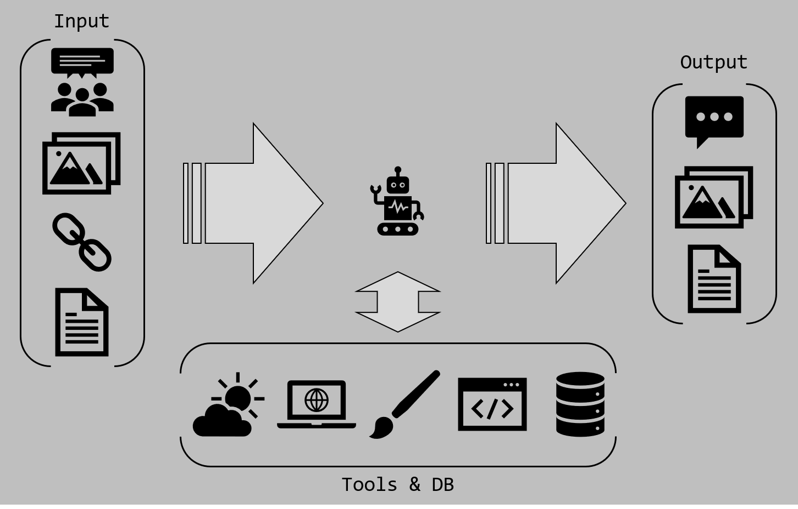

# Discord Bot Become Human

OpenAI 대화 모델을 적절히 사용하여 디스코드 채널에서 자연스럽게 사람들의 대화에 참여하는 봇.



**Multi-User Conversation**  


**Reference message & Vision**  


**Function Calls** (Weather, Search, Image Gen/Edit, Interpreter, Query DB)  


## Features

- [x] 정해진 채널에서 다자간 대화 수집.
  - 수집 텍스트 : 작성자, 작성일, 내용, og:title/description
  - 수집 이미지 : 첨부, 이모지, 스티커, HTTP URL, og:image
  - 수집 파일(이미지 외) : 첨부
- [x] 채널이 일정시간 이상 조용하거나 봇이 멘션되면 수집한 맥락을 가지고 대화 시작.
- [x] 대화 시작 이후에는 멘션이 없어도 일정시간 뒤 응답.
- [x] 응답을 할지 말지 판단.
- [x] 대화를 중지할지 말지 판단.
- [x] 대화 주제가 전환되었는지 판단.
- [x] 대화 중지 또는 주제 전환시 이전 대화를 내부적으로 요약.
- [x] 함수 호출 기능 사용하여 기능 확장.
  - [x] 현재 날씨 및 예보 조회. ([Weatherbit](https://www.weatherbit.io/))
  - [x] 인터넷 검색 또는 URL 읽기. ([Tavily AI](https://tavily.com/), [Jina AI](https://jina.ai/))
  - [x] 이미지 생성. ([Stability AI](https://platform.stability.ai/), [RunPod Fooocus](https://github.com/NeuroWhAI/RunPod-Fooocus-API))
  - [x] 코드 실행. ([Pyodide](https://pyodide.org/en/stable/))
  - [x] 이전 대화 검색. ([Chroma](https://www.trychroma.com/))
  - [x] 복잡한 질문에 대해 추론. ([OpenAI](https://platform.openai.com/docs/guides/reasoning))
- [x] 이전 대화들을 정리하여 임베딩 계산 후 DB에 저장.
- [x] 메모장 느낌으로 채널과 사람에 대해 기억하고 대화에 활용.
- [ ] 좀 더 똑똑하게 대화 참여 및 나가기.

## Config

### .env

```env
CLIENT_ID={Discord App ID}
DISCORD_TOKEN={Discord Bot Token}
CHANNEL_WHITELIST={Discord Channel IDs : e.g. 321545304510012344,321545304510012345}
OPENAI_API_KEY={OpenAI API Key}
OPENAI_CHAT_MODEL={e.g. gpt-4o}
OPENAI_REASONING_MODEL={e.g. o1-mini}
OPENAI_EMBEDDING_MODEL={e.g. text-embedding-3-large}
CHROMA_DB_URL={e.g. http://localhost:8000}

WEATHER_BIT_API_KEY={Weatherbit API Key}
TAVILY_API_KEY={Tavily API Key}
STABILITY_API_KEY={Stability API Key}
RUNPOD_API_KEY={RunPod API Key}
RUNPOD_ANIME_IMAGEN_ENDPOINT_ID={RunPod Anime Image Generation Endpoint ID : e.g. gblook0abcdefg}
JINA_API_KEY={Jina API Key}
```
